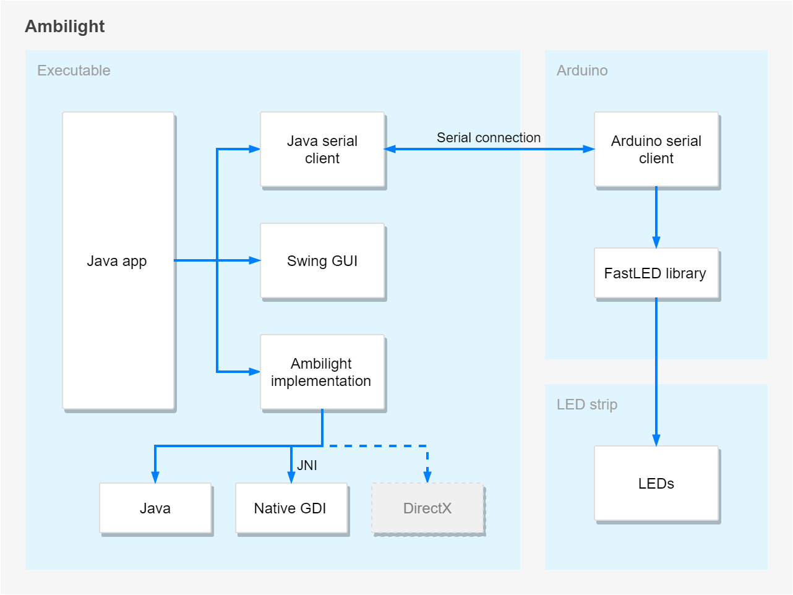

# Ambilight

This is a homemade implementation of an Ambilight setup, similar to what Phillips does with their
Ambilight TVs.

## Structure
The project is composed of several components.

The entry point of the application is written in **Java**. When the application starts it opens 
a GUI window through which it is possible to control the application and alter its parameters.

### Retrieving screen contents
The key part of the application is periodic retrieval and processing of colors displayed on the 
screen. In a dream scenario, this should be able to run as often as the screen refreshes. This can
be quite a work-intensive process and may put a big load on the CPU, especially if we want 
reasonable performance.

Implementing this in Java would be a poor decision. The only way to retrieve screen contents is 
through `java.awt.Robot` class which is not optimized for such use case. It was capable of running 
at 15 FPS at best while CPU was permanently under heavy load.

Thus I decided to do the CPU-intensive computations in a C/C++ world that is much closer to the
hardware. The application does not perform any computation itself but delegate all calls to a 
pre-compiled C++ library via JNI bridge.

The native library utilizes Windows GDI to retrieve screen contents. It does not perform as well 
as DirectX or OpenGL do but the complexity of implementation is much lower. It is capable of 
running at 30 FPS with CPU utilization several times smaller compared to pure Java implementation. 
 
### Communication with Arduino

Java application communicates with Arduino using serial connection.

WS2812B LED strip

## Gradle configuration
There are several ways how to structure the code and build the application.
We can use built-in gradle plugin 'c' or 'cpp' together with 'java' plugin in the same module.
These plugins are deprecated though and replaced with 'cpp-application' and 'cpp-library' plugins.
(No support for 'c-application' or 'c-library'?)